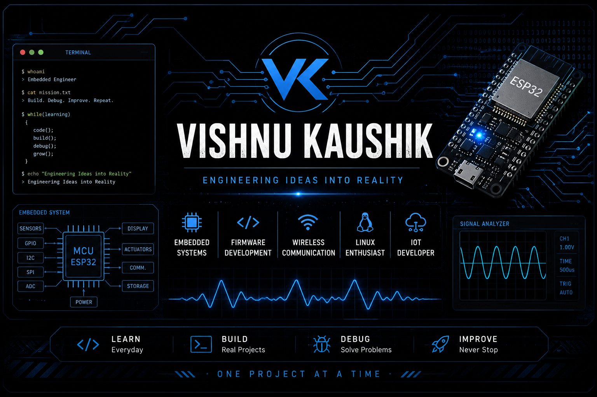

<div align="center">



<br>

# VISHNU KAUSHIK

### Engineering Ideas into Reality

<br>


<br>


</div>

---

<table width="100%">
<tr>

<td width="50%" valign="top">

<h2 align="center">About</h2>

<table>
<tr>

<td width="55%" valign="top">

I'm an Electronics & Communication Engineering undergraduate at **RNS Institute of Technology** with a strong interest in **Embedded Systems, Firmware Development, IoT, and Communication Systems**.

I enjoy building projects that combine hardware and software, while continuously improving my Linux, Embedded C, and system design skills.

</td>

<td width="45%" valign="top">

```text
College   : RNSIT

Semester  : 5

Focus     : Embedded Systems

Learning  : Linux • Embedded C

Goal      : Firmware Engineer
```

</td>

</tr>
</table>

---

<h2 align="center">Tech Stack</h2>

<div align="center">


<br><br>


</div>

---

## > current_mission

```text
• Learn Linux

• Master Embedded C

• Build ESP32 Projects

• Strengthen Communication Systems

• Engineer Ideas into Reality
```

</td>

</tr>
</table>

---

## 💻 Tech Stack

<div align="center">


<br><br>


</div>

### Languages

```text
C
C++
Python
MATLAB
Verilog
Bash
```

</td>

<td width="25%" valign="top">

### Embedded

```text
ESP32
Arduino
8051
FPGA
```

</td>

<td width="25%" valign="top">

### Protocols

```text
LoRa
Wi-Fi
UART
SPI
I²C
```

</td>

<td width="25%" valign="top">

### Tools

```text
Linux
Git
GitHub
VS Code
Arduino IDE
Multisim
```

</td>

</tr>
</table>

---

<div align="center">

## > github_stats


<br><br>


</div>

---
